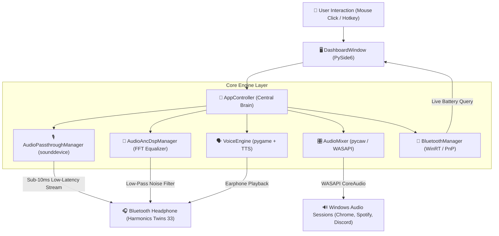
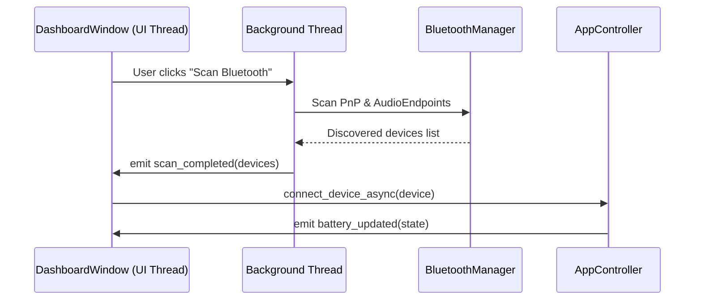

# 🧠 01. High-Level Architecture & System Design

Welcome to the **KaanShield** architecture guide! This document explains how KaanShield works under the hood so that anyone — from beginners to experienced developers — can understand how the app controls Bluetooth headphones and Windows desktop audio.

---

## 🏛️ High-Level System Architecture

KaanShield uses an **Event-Driven Controller Architecture**. The application is split into four decoupled layers:

1. **Presentation Layer (`ui/`):** PySide6 GUI dashboard, system tray icon, and animated glassmorphism HUD popups.
2. **State & Orchestration Layer (`core/app_controller.py`):** The central controller that manages app state, handles mode toggling, and coordinates background engines.
3. **Core Engine Layer (`core/`):** Independent hardware and audio modules for sound passthrough, DSP noise suppression, WASAPI mixer, voice cues, and Bluetooth scanning.
4. **Hardware Driver Layer (`drivers/`):** Device drivers for generic Bluetooth headphones, Sony WH/WF series, AirPods, and Galaxy Buds.

---

## 📊 Complete System Component Flow Diagram

---

## 🔑 Key Technology Stack Explained

| Library / SDK | Why It Is Used | How It Works |
| :--- | :--- | :--- |
| **PySide6 (Qt for Python)** | Desktop Graphical User Interface (GUI) | Provides native cross-platform windowing, widgets, QSS glassmorphism styling, and thread-safe Signals & Slots. |
| **sounddevice (PortAudio)** | Low-latency audio streaming | Opens direct audio callback streams between input microphone and output headphones with sub-10ms delay. |
| **pycaw** | Windows WASAPI CoreAudio API | Interfaces with Windows CoreAudio to control master volume and individual application volumes. |
| **winsdk (Windows WinRT)** | Windows System Bluetooth APIs | Reads native Windows Bluetooth DeviceInformation and Association Endpoint properties. |
| **pygame.mixer** | Voice cue audio playback | Re-binds audio handles dynamically on demand to stream custom MP3 voice lines directly into connected earphones. |
| **pythoncom** | Windows COM Thread Initialization | Ensures background thread speech synthesis (`pyttsx3`) executes without COM initialization crashes. |

---

## 🧵 Threading & Signal-Slot Model

To keep the UI running at 60 FPS without freezing when running long-running operations (like Bluetooth scanning or audio streaming), KaanShield uses **Qt Signals & Slots**:

