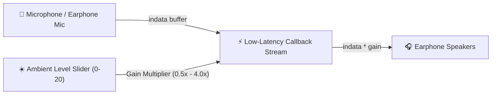
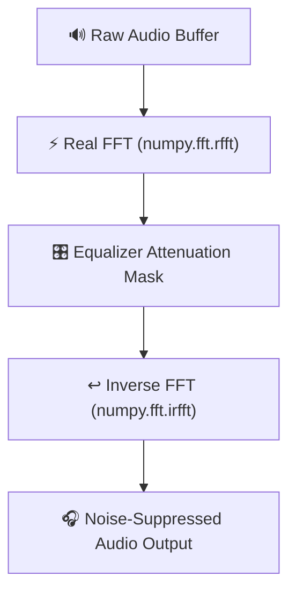

# 🎙️ 02. Audio Passthrough & Software ANC DSP

This document explains how **Transparency Mode** (real-time microphone sidetone passthrough) and **Software Active Noise Cancellation (ANC DSP)** work in KaanShield.

---

## 👤 Real-Time Transparency Passthrough (`core/audio_passthrough.py`)

### Problem
Generic Bluetooth earphones (such as `Harmonics Twins 33`, `Noise Buds`, `Zebronics`) do not expose a hardware Transparency Mode button on Windows.

### Solution
KaanShield uses **`sounddevice` (PortAudio)** to capture audio from the system/earphone microphone and stream it directly into the earphone speakers in real time.

### How Gain Multiplier Works
When you drag the **Ambient Level Slider** (0 to 20):
$$\text{Gain} = \text{max}\left(0.2, \text{min}\left(5.0, \frac{\text{Level}}{10.0} \times 2.0\right)\right)$$

- Level **0**: Silent passthrough (`0.2x` gain).
- Level **10**: Natural environment volume (`2.0x` gain).
- Level **20**: Amplified environmental hearing (`4.0x` gain).

---

## 📶 Software Active Noise Cancellation (`core/audio_anc_dsp.py`)

### Problem
How can software suppress background room hums (HVAC, fan noise) and high-frequency hiss for earphones without built-in hardware ANC?

### Solution
KaanShield applies **Real-Time Fast Fourier Transform (FFT) Frequency Filtering** using `numpy.fft`.

### Frequency Filter Mask Logic

$$\text{Filter Mask}(f) = 
\begin{cases} 
0.35 & \text{if } f < 200\text{ Hz (Low HVAC / Fan Hums)} \\
0.40 & \text{if } f > 8000\text{ Hz (High-Frequency Hiss)} \\
1.00 & \text{otherwise (Vocal Range 200Hz - 8kHz)}
\end{cases}$$

This suppresses background room rumble while keeping human speech clear!
