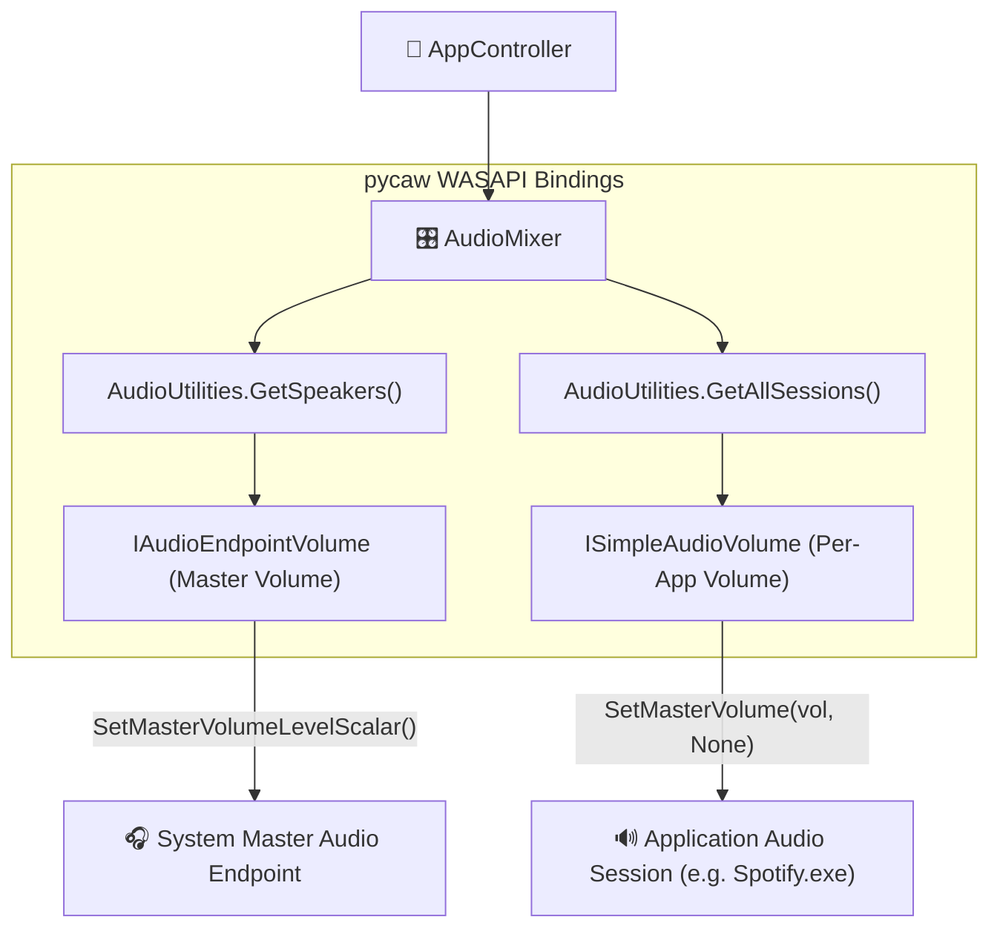

# 🎛️ 03. Windows Audio Session API (WASAPI) & Volume Mixer

This document details how **KaanShield** controls master volume and per-app application volumes in Windows using `pycaw`.

---

## 🏛️ What is WASAPI?

**WASAPI** (Windows Audio Session API) is Microsoft's native C++ CoreAudio architecture introduced in Windows Vista. It manages all audio streams rendered by applications (Chrome, Spotify, Discord, Games) and routes them to default audio endpoint hardware (Headphones, Speakers).

---

## 🔧 Pycaw Architecture Integration

`pycaw` provides Python COM bindings to WASAPI Interfaces:



---

## 🎧 Master Volume Control (Position #0)

In `core/audio_mixer.py`, the **Master Volume** stream is placed at position `#0` in the mixer table:

```python
speakers = AudioUtilities.GetSpeakers()
volume_ctrl = speakers.EndpointVolume
volume_ctrl.SetMasterVolumeLevelScalar(clamped_volume, None)
```

Dragging the Master Volume slider changes the **ACTUAL master sound level of your Windows PC and earphone** live!

---

## 🌐 Per-App Volume & Mute Toggling

When you move a volume slider or click the Mute button for an application (e.g. Chrome or Spotify):

```python
sessions = AudioUtilities.GetAllSessions()
for session in sessions:
    proc_name = session.Process.name() if session.Process else "system"
    if proc_name.lower() == target_process:
        vol_ctrl = session._ctl.QueryInterface(ISimpleAudioVolume)
        # Set Volume (0.0 to 1.0)
        vol_ctrl.SetMasterVolume(volume, None)
        # Toggle Mute (True/False)
        vol_ctrl.SetMute(new_mute_state, None)
```

### Visual Button States in GUI

- **Unmuted / Active State:** Button text `🎙️ Active` in vibrant green (`#22c55e`).
- **Muted State:** Button text `🚫 Muted` in bright red (`#ef4444`).
