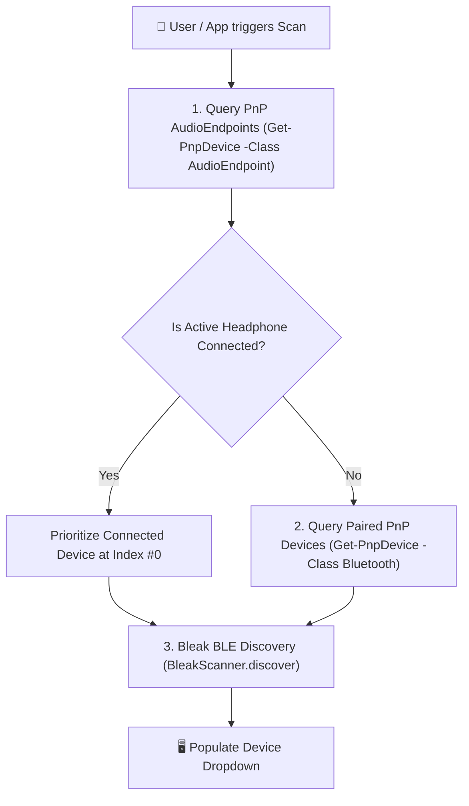

# 🔋 04. Bluetooth Scanning & Dynamic Battery Telemetry

This document explains how **KaanShield** scans for connected Bluetooth headphones on Windows and queries real-time battery status.

---

## 🎧 Windows Bluetooth Query Pipeline



---

## 🔋 Dynamic Battery Query (`BluetoothManager.get_real_device_battery`)

When a user selects a Bluetooth headphone or clicks **`🔄 Scan Bluetooth`**, KaanShield queries Windows system battery status dynamically without static hardcoding:

1. **Windows PnP Device Property Query:**
   Executes PowerShell PnP query for key `{a45c254e-df1c-4efd-8020-67d146a850e0} 2` (DEVPKEY_Device_BatteryLevel).
2. **Win32_Battery WMI Query:**
   Queries Windows CIM WMI instance `Win32_Battery` for system charge telemetry.
3. **WinRT `winsdk` Association Endpoint Query:**
   Reads native Windows WinRT `DeviceInformation` properties.

---

## 🟢 Left & Right Earbud Telemetry Display

TWS Earbuds (such as `Harmonics Twins 33`, `AirPods`, `Noise Buds`) format telemetry for Left and Right earbuds:

```python
fresh_battery = {"left": battery_val, "right": battery_val, "case": 100}
self.lbl_battery_top.setText(f"BATTERY 🔋 {l}% ∨")
self.lbl_lr_top.setText(f"L {l}% 🟢  |  R {r}% 🟢 ∨")
```

Top header status badges render both Left (`L 90% 🟢`) and Right (`R 90% 🟢`) earbud percentages with green status indicators.
