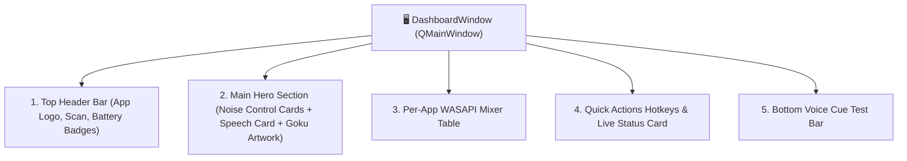
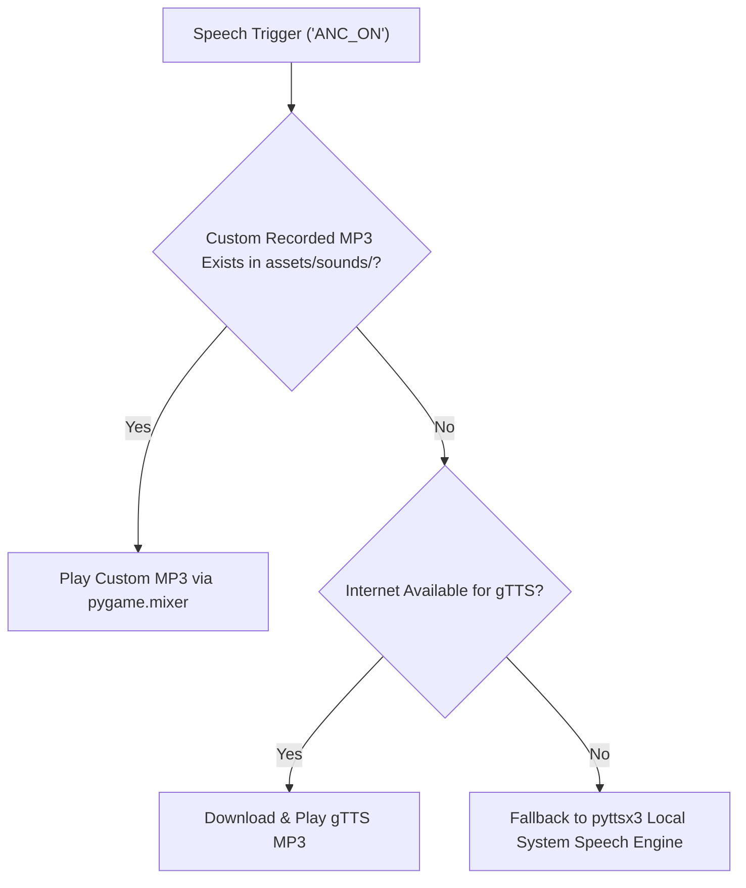

# 🗣️ 05. PySide6 GUI & Voice Engine

This document details the **PySide6 / Qt User Interface** and the **Voice Feedback Engine**.

---

## 🎨 PySide6 GUI Architecture (`ui/dashboard_window.py`)

KaanShield uses **PySide6** (Qt for Python) with a custom **QSS Glassmorphism Design System**:



---

## 🗣️ Voice Feedback Engine (`core/voice_engine.py`)

The **VoiceEngine** plays custom slang audio recordings inside the user's earphone whenever ANC modes or battery statuses change.

### Voice Playback Strategy



### Dynamic Earphone Output Re-binding
`pygame.mixer` locks to the default Windows audio output device. When voice playback occurs:

```python
if pygame.mixer.get_init():
    pygame.mixer.quit()
pygame.mixer.init()  # Re-binds to target connected earphone (Harmonics Twins 33)
pygame.mixer.music.load(custom_mp3)
pygame.mixer.music.play()
```

### Windows COM Thread Safety
When running local text-to-speech in background worker threads on Windows:

```python
import pythoncom
pythoncom.CoInitialize()  # Prevents [WinError -2147221008] CoInitialize has not been called
```
